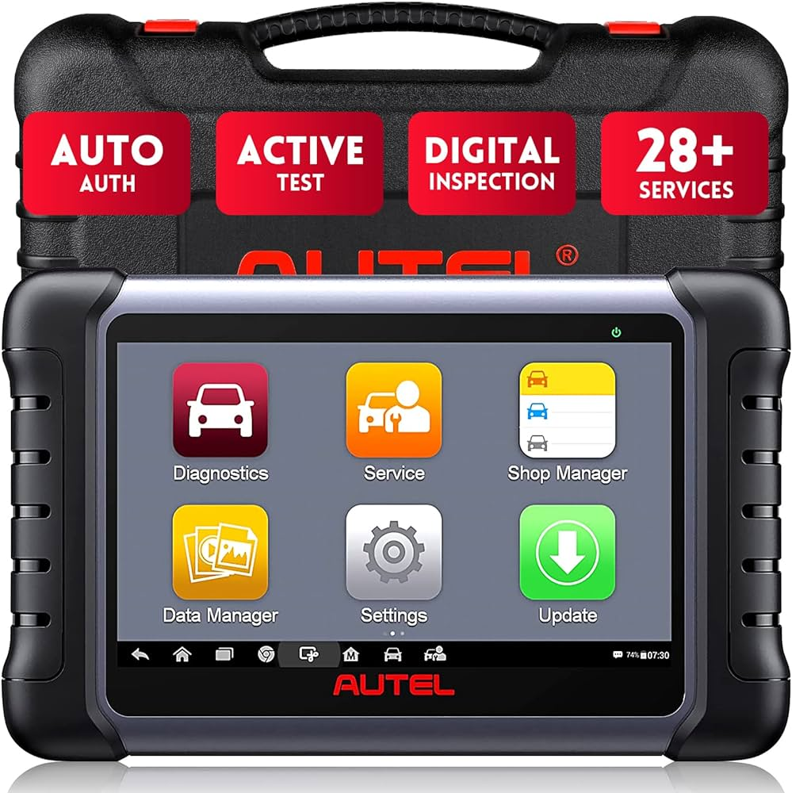
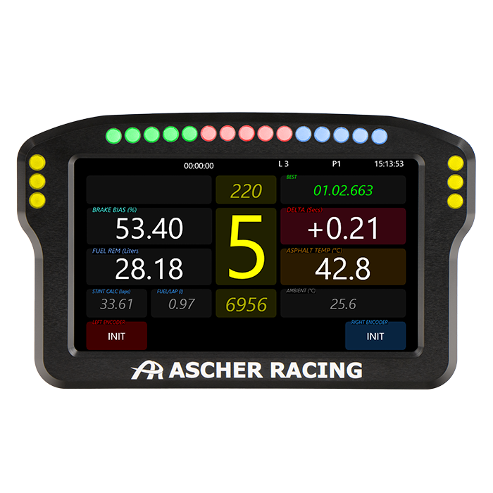
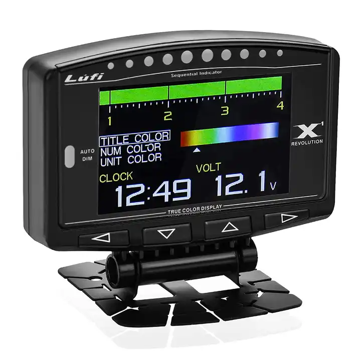
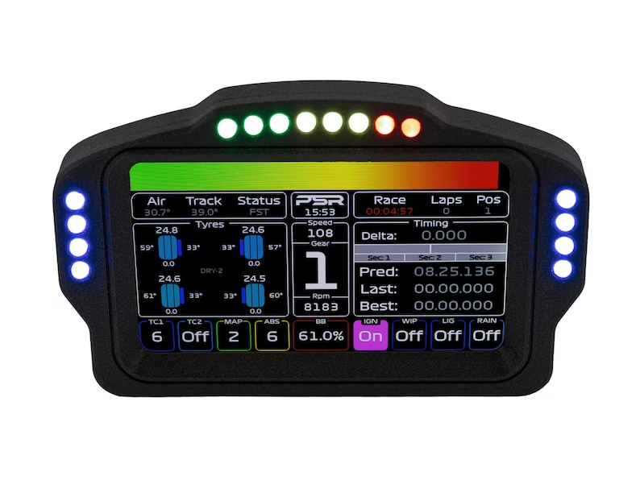

## Design Outline

## Main Menu Display

I really like the rounded icons with the gradient on top of the colour.

## Racing display
A few inspirations for potential layouts of the racing HUD

I am going to want to separate the diagnostics display and racing display.  These give some ideas for the colour scheme and layouts I would like to do.