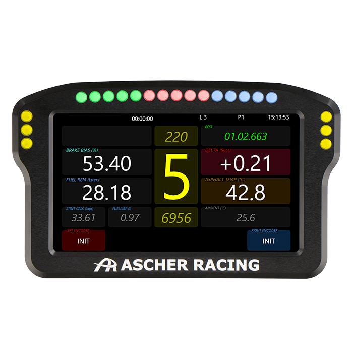
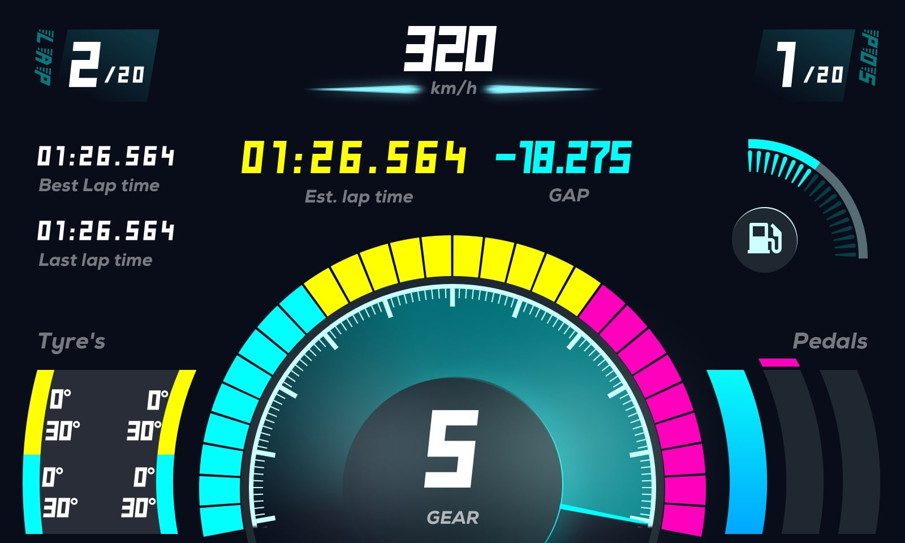
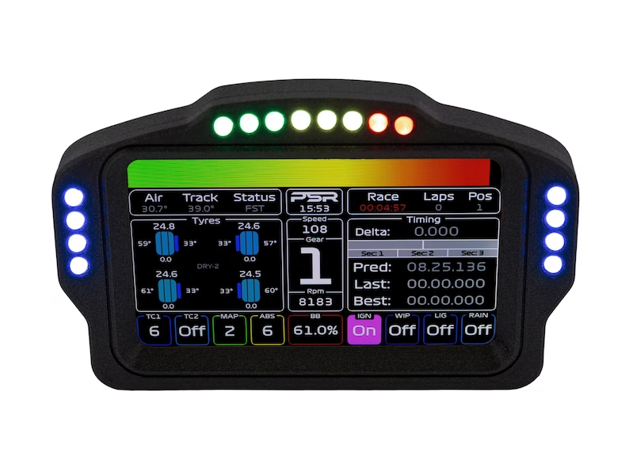
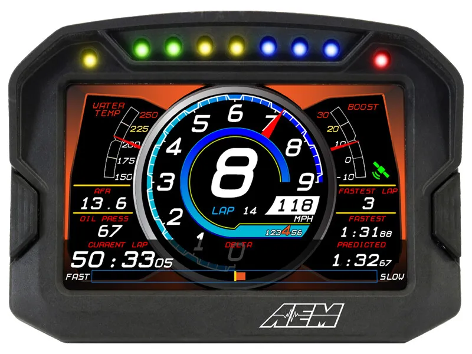
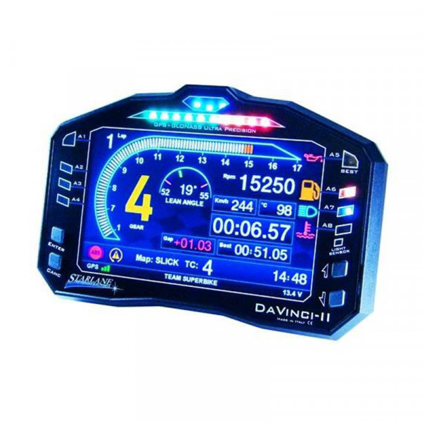

# Summary
By Cuba Giesbrecht
PiPOC (Pi Proof of Concept) is a Python program for a Raspberry Pi that reads the cars diagnostics and displays it on the display through its OBD2 port.  It's called a proof of concept, since once I get a good working version I will rewrite it in something faster (most likely in C++).

For now it is being written specifically for my Raspberry Pi 3 B+ with a 1024x600 IPS LCD in a 2004 Mazda RX-8.  Some of the constants will be set with this in mind.

## Goals
- Move OBD reading to a separate thread (Constant and in the background)
- Protect OBD requests from disconnects and hardware issues (Try catch)
- Clean up OBD display

## Installation
I am using the following libraries and will need to be installed:

- [Pygame](https://www.pygame.org)
- [Python OBD](https://python-obd.readthedocs.io/en/latest/)

these are the provided commands to install both:
```
python3 -m pip install -U pygame --user
pip install obd
```

## Design Outline

### Main Menu Display

I really like the rounded icons with the gradient on top of the colour.

### Racing display
A few inspirations for potential layouts of the racing HUD






I am going to want to separate the diagnostics display and racing display.  The last image